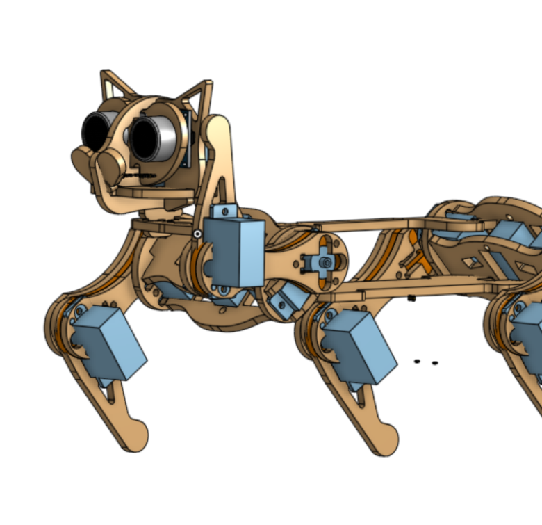

# 🐾 Proyecto Animatrónico con PIC – Control de Servomotores por ADC, EEPROM y Serial

Este proyecto implementa el control de 4 servomotores usando un microcontrolador PIC16F887 a través de tres modos operativos: entrada analógica (ADC), almacenamiento/recuperación desde EEPROM y comunicación serial por EUSART. El objetivo es crear una base de control adaptable para sistemas animatrónicos, como un robot cuadrúpedo inspirado en el gato robótico **Nybble**.

> 📌 **Inspiración**: Este diseño toma como referencia el modelo Nybble desarrollado por [Petoi](https://www.petoi.com/nybble), adaptándolo al uso de servomotores de mayor tamaño y una plataforma basada en microcontroladores PIC.

---

## 🎯 Funcionalidades principales

- Control de 4 servomotores (RC0-RC3) con señal PWM manual (1–2 ms cada 20 ms).
- Entrada por:
  - **4 potenciómetros** para control manual vía ADC (AN4–AN7).
  - **Serial UART (EUSART)** para lectura y escritura de valores desde un PC.
  - **EEPROM** para recuperación y almacenamiento persistente de posiciones.
- Interfaz simple con **2 DIP switches**, **pushbutton** y **4 LEDs** para modo de operación y feedback.
- Compatible con herramientas como **Python** para interacción vía UART.

---

## 🔧 Hardware Requerido

| Componente                  | Detalles                        |
|----------------------------|---------------------------------|
| Microcontrolador           | PIC16F887                       |
| Servomotores               | 4x tipo SG90 o similares        |
| Potenciómetros             | 4x conectados a AN4–AN7         |
| Comunicación serial        | FTDI/USB-UART (RC6, RC7)        |
| LED indicadores            | 4x en RA0–RA3                   |
| DIP Switch                 | 2x en RB0 y RB1                 |
| Pushbutton                 | 1x en RB2                       |
| Fuente de alimentación     | 5V (recomendada externa para servos) |

---

## 🎛️ Modos de Operación

Controlado mediante el estado de RB0 y RB1 (DIP switches):

| Modo | RB1 | RB0 | Descripción                                                  |
|------|-----|-----|--------------------------------------------------------------|
| 1    | 0   | 0   | Modo ADC: lectura en vivo de potenciómetros para control     |
| 2    | 0   | 1   | Modo EEPROM: carga de valores guardados previamente          |
| 3    | 1   | 0   | Modo Serial: valores enviados desde PC vía UART              |
| 4    | 1   | 1   | (Reservado para futuras expansiones)                         |

El **pushbutton (RB2)** permite guardar la configuración actual en EEPROM.

---

## 🧠 Código Principal

El programa fue escrito en lenguaje C usando MPLAB X IDE y XC8. El control PWM se realiza de forma manual con interrupciones mediante los temporizadores Timer0 y Timer1. También se incluye control por PWM por hardware (CCP1 y CCP2).

Puedes encontrar el código fuente completo en [`main.c`](./main.c).

---

## 🛠 Archivos de Modelado 3D

El modelo 3D del animatrónico está disponible en la carpeta [`/modelo_3D/`](./modelo_3D/). Incluye archivos STL para impresión de las piezas adaptadas al tamaño de los servos utilizados.

---

## 💡 Créditos

- Proyecto inspirado en el robot **Nybble** por [Petoi](https://github.com/PetoiCamp).
- Adaptación del diseño para servos SG90 y controladores PIC por **Estuardo Castillo**.
- Modelado 3D realizado en [Fusion 360/FreeCAD (según corresponda)].

---

## 🚀 Próximos pasos

- Implementación de movimientos preprogramados (caminar, sentarse, etc.).
- Conexión con GUI en Python para control en tiempo real.
- Uso de sensores para retroalimentación y autonomía.

---

## 📜 Licencia

Este proyecto se distribuye bajo la licencia MIT. Revisa el archivo [`LICENSE`](./LICENSE) para más información.

---

